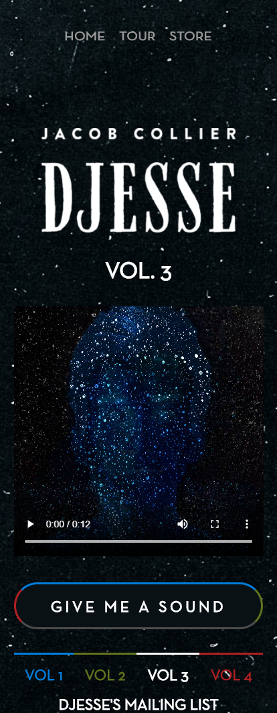
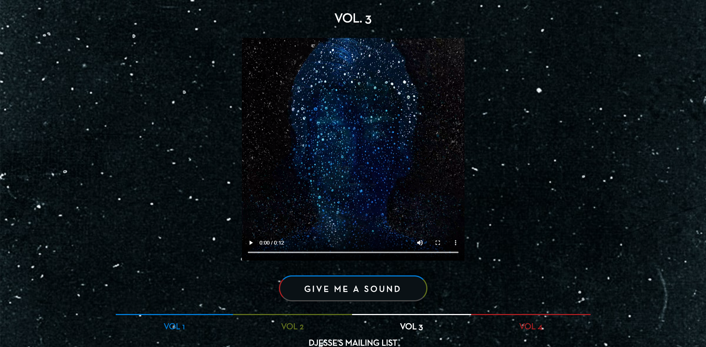
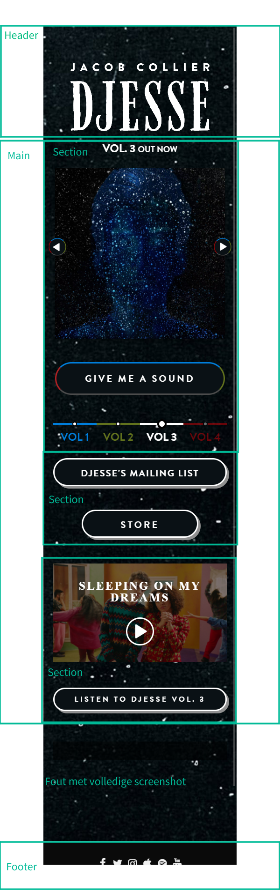
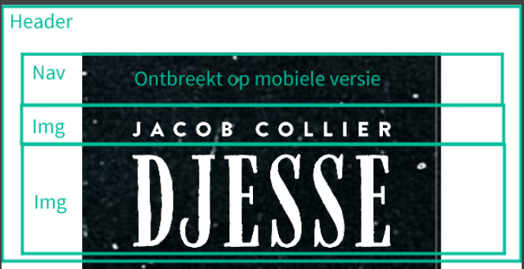
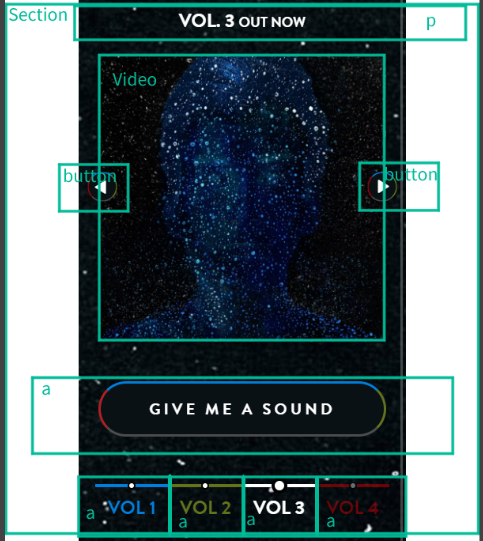
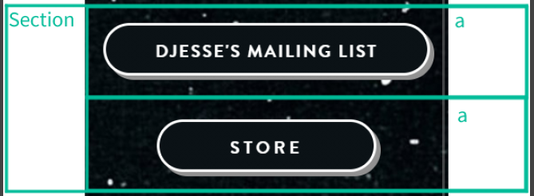
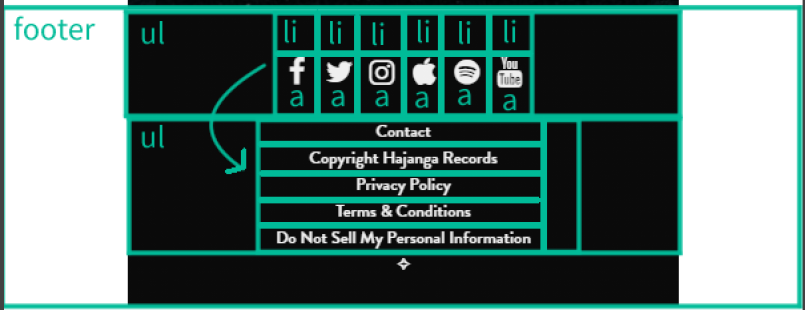

# Procesverslag
**Auteur:** Philip van Egmond
https://philipvegmond.github.io/Frontend-Website/

Markdown cheat cheet: [Hulp bij het schrijven van Markdown](https://github.com/adam-p/markdown-here/wiki/Markdown-Cheatsheet). Nb. de standaardstructuur en de spartaanse opmaak zijn helemaal prima. Het gaat om de inhoud van je procesverslag. Besteedt de tijd voor pracht en praal aan je website.

## Bronnenlijst
1. -bron 1-
2. -bron 2-
3. -...-

## Eindgesprek (week 7/8)

-dit ging goed & dit was lastig-

**Screenshot(s):**

-screenshot(s) van je eindresultaat-

## Voortgang 3 (week 6)

-same as voortgang 1-

## Voortgang 2 (week 5)

-same as voortgang 1-

## Voortgang 1 (week 3)

### Stand van zaken

-dit ging goed & dit was lastig-  
Ik ben vooral heel veel tijd kwijt aan mijn Homepage. 
Deze heeft vier verschillende thema's die ik werkende moet maken en een interactief video element, ik wil mezelf namelijk graag uitdagen.
Ook ben ik meteen al bezig met alles responsive maken. Hierom ben ik veel meer tijd kwijt en heb ik de pagina niet af.

Ik heb moeite met het stylen van de album storepage navigatie. Het is een ul van a's met een opmaak die ik niet helemaal snap.

Verder moet ik de video wel nog klikbaar maken, ik heb een goed idee van hoe ik dat kan doen maar ik zorg eerst dat alle content in de site staat.

Voor de rest gaat het eigenlijk heel lekker, ik ben verder nog niks tegengekomen waar ik vast ben blijven zitten.

**Screenshot(s):**

-screenshot(s) van hoe ver je bent-

### Agenda voor meeting

Wat moet er in de bronnenlijst?  
Advies album storepage navigatie.

### Verslag van meeting

-na afloop snel uitkomsten vastleggen-

## Intake (week 1)

**Je startniveau:** HTML en CSS rood, JS zwart

**Je focus:** Responsive

**Je opdracht:** https://www.jacobcollier.com/

**Screenshot(s):**

 

**Breakdown-schets(en):**

