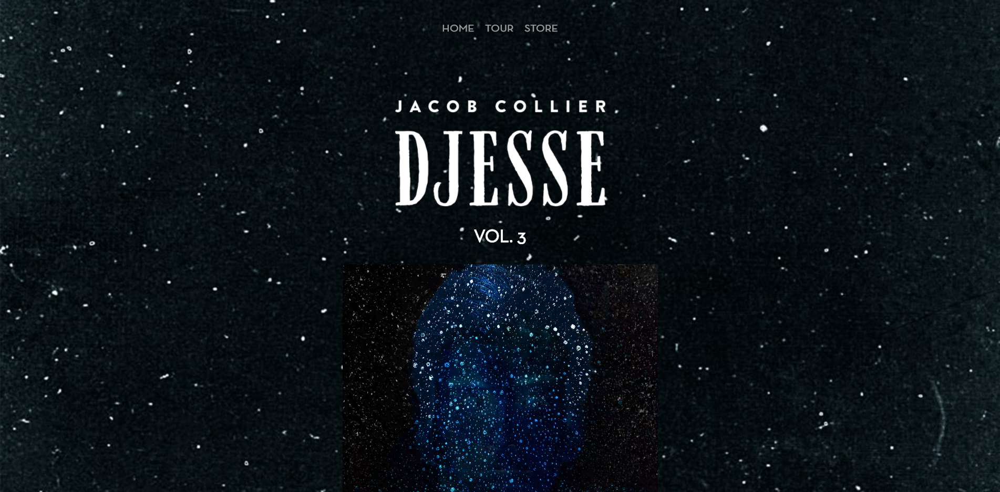
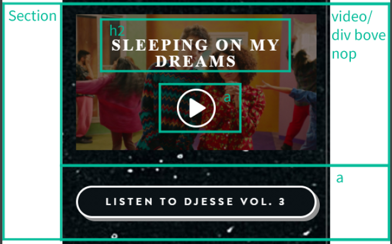

# Procesverslag
**Auteur:** Philip van Egmond
https://philipvegmond.github.io/Frontend-Website/

Markdown cheat cheet: [Hulp bij het schrijven van Markdown](https://github.com/adam-p/markdown-here/wiki/Markdown-Cheatsheet). Nb. de standaardstructuur en de spartaanse opmaak zijn helemaal prima. Het gaat om de inhoud van je procesverslag. Besteedt de tijd voor pracht en praal aan je website.

## Bronnenlijst
1. -https://jacobcollier.com voor alle content en enkele CSS trucjes als invert om de header images wit te maken.-
2. -https://www.bitdegree.org/learn/responsive-image#:~:text=Using%20CSS%2C%20you%20can%20set,or%20bigger%20than%20the%20viewport. voor het responsive maken van de backgrounds.-
3. -https://freefontsfamily.com/neutra-text-font-family-free-download/ font.-
4. -https://css-tricks.com/snippets/css/a-guide-to-flexbox/ voor flexbox.-
5. -https://w0.pngwave.com/png/261/757/computer-icons-google-play-music-button-play-png-clip-art-thumbnail.png Play button.-
6. -https://riptutorial.com/css/example/4130/multiple-transforms Door dit artikel kwam ik erachter hoe je meerdere transforms op één element kan toepassen.-

## Eindgesprek (week 7/8)

-dit ging goed & dit was lastig-

**Screenshot(s):**

-screenshot(s) van je eindresultaat-

## Voortgang 3 (week 6)

-same as voortgang 1-

## Voortgang 2 (week 5)

-same as voortgang 1-

## Voortgang 1 (week 3)

### Stand van zaken

-dit ging goed & dit was lastig-  
Ik ben vooral heel veel tijd kwijt aan mijn Homepage. 
Deze heeft vier verschillende thema's die ik werkende moet maken en een interactief video element, ik wil mezelf namelijk graag uitdagen.
Ook ben ik meteen al bezig met alles responsive maken. Hierom ben ik veel meer tijd kwijt en heb ik de pagina niet af.

Ik heb moeite met het stylen van de album storepage navigatie. Het is een ul van a's met een opmaak die ik niet helemaal snap.

Verder moet ik de video wel nog klikbaar maken, ik heb een goed idee van hoe ik dat kan doen maar ik zorg eerst dat alle content in de site staat.

Voor de rest gaat het eigenlijk heel lekker, ik ben verder nog niks tegengekomen waar ik vast ben blijven zitten.

**Screenshot(s):**

-screenshot(s) van hoe ver je bent-

### Agenda voor meeting

Wat moet er in de bronnenlijst?  
Advies album storepage navigatie.

### Verslag van meeting

-na afloop snel uitkomsten vastleggen-
Ik heb mijn aanpak over het video element gedeeld en de studentassistenten denken dat het zal werken.
Ik zet de video in een div, verder zet ik hier 4 spans in. 
Met position absolute haal ik de video uit de normal flow en met flexbox kan ik de spans allen 50% width en height meegeven. 

De puntjes in borders van de album storepage navigatie was onduidelijk voor mij hoe die daar kwamen.
Jesse had me aangeraden naar ::before te kijken, hiermee moet ik het zeker kunnen oplossen!

Ook zei hij dat het het makkelijkst is de video en de previous en next button in container element te zetten zodat ik die makkelijk met z'n drieën kan positioneren.

## Intake (week 1)

**Je startniveau:** HTML en CSS rood, JS zwart

**Je focus:** Responsive

**Je opdracht:** https://www.jacobcollier.com/

**Screenshot(s):**

 

**Breakdown-schets(en):**

