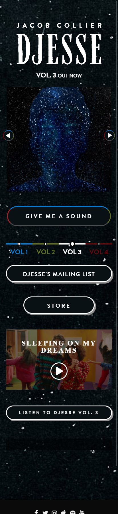
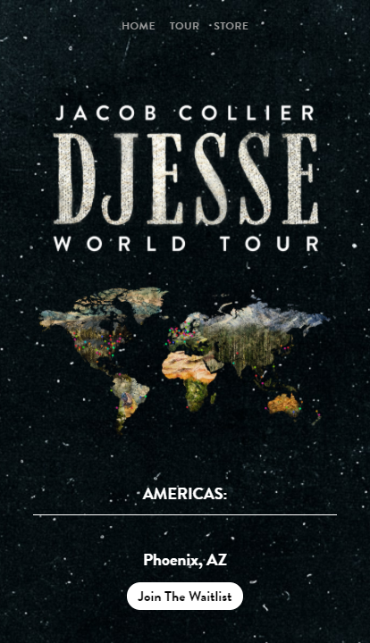

# Procesverslag
**Auteur:** Philip van Egmond
https://philipvegmond.github.io/Frontend-Website/

Markdown cheat cheet: [Hulp bij het schrijven van Markdown](https://github.com/adam-p/markdown-here/wiki/Markdown-Cheatsheet). Nb. de standaardstructuur en de spartaanse opmaak zijn helemaal prima. Het gaat om de inhoud van je procesverslag. Besteedt de tijd voor pracht en praal aan je website.

## Bronnenlijst
1. -bron 1-
2. -bron 2-
3. -...-

## Eindgesprek (week 7/8)

-dit ging goed & dit was lastig-

**Screenshot(s):**

-screenshot(s) van je eindresultaat-

## Voortgang 3 (week 6)

-same as voortgang 1-

## Voortgang 2 (week 5)

-same as voortgang 1-

## Voortgang 1 (week 3)

### Stand van zaken

-dit ging goed & dit was lastig-
Ik ben vooral heel veel tijd kwijt aan mijn Homepage. 
Deze heeft vier verschillende thema's die ik werkende moet maken en een interactief video element, ik wil mezelf graag uitdagen.
Ook ben ik meteen al bezig met alles responsive maken. Hierom ben ik veel meer tijd kwijt en heb ik de pagina niet af.

Ik heb moeite met het stylen van de album navigatie. Het is een ul van a's met een ingewikkelde opmaak.

Ook heb ik nog niet helemaal bedacht hoe ik de vlakverdeling boven de video kan regelen op een manier dat het responsive blijft. Dit lijkt me de aller grootste uitdaging.

**Screenshot(s):**

-screenshot(s) van hoe ver je bent-

### Agenda voor meeting

-samen met je groepje opstellen-
Wat moet er in de bronnenlijst?  

### Verslag van meeting

-na afloop snel uitkomsten vastleggen-

## Intake (week 1)

**Je startniveau:** HTML en CSS rood, JS zwart

**Je focus:** Responsive

**Je opdracht:** https://www.jacobcollier.com/

**Screenshot(s):**

 

**Breakdown-schets(en):**

